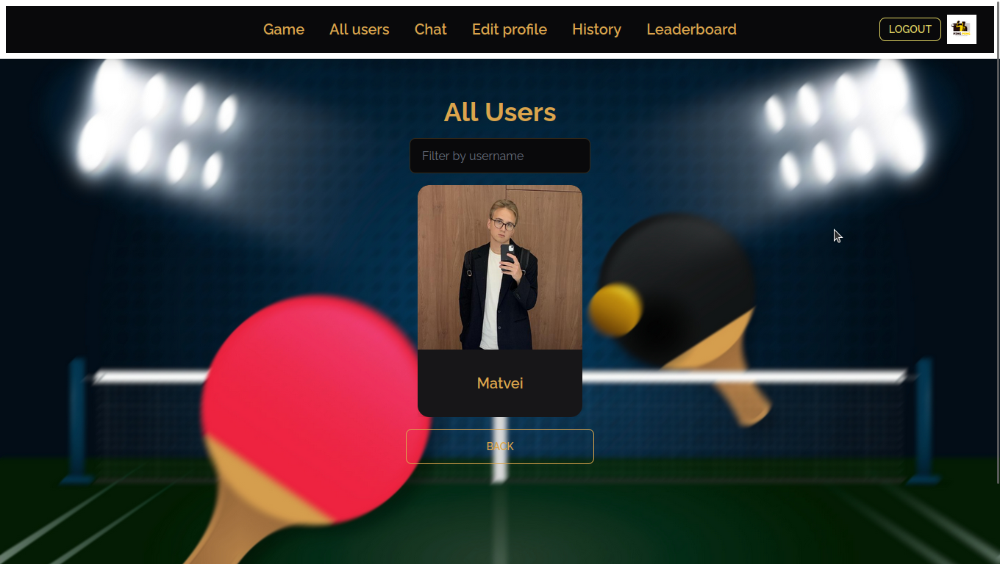

# ft_transcendence

## Overview
The `ft_transcendence` project is a robust website designed for hosting a Pong contest. Users can engage in real-time multiplayer Pong games, communicate via a chat system, and enjoy an intuitive user interface.

## Usage

### Prerequisites
- Docker and Docker Compose installed on your system.
- PostgreSQL database configuration and access credentials.

### Steps

1. **Clone Repository:**
   ```bash
   git clone https://github.com/yourusername/your-ft_transcendence.git
   cd your-ft_transcendence
   ```

2. **Setup Environment Variables:**
   - Create a `.env` file in the root directory.
   - Fill in necessary environment variables following the `.env` example provided in the project.

3. **Run the Project:**
   - Start the project using Docker Compose:
   ```bash
   make up
   ```

4. **Access the Application:**
   - Once the containers are up and running, access the application:
     - Frontend: `http://localhost:your_frontend_port`
     - Backend/API: `http://localhost:your_backend_port`
     - PostgreSQL: `localhost:your_postgresql_port`

5. **Additional Commands:**

   - **Check status of containers:**
     ```bash
     make status
     ```

   - **View logs:**
     ```bash
     make logs
     ```

   - **Access specific service logs:**
     ```bash
     make blog  # Backend logs
     make flog  # Frontend logs
     make nlog  # Nginx logs
     make plog  # PostgreSQL logs
     ```

6. **Shut Down the Project:**
   - Stop all running containers:
   ```bash
   make down
   ```

7. **Cleaning Up:**
   - Remove project data and clean Docker resources:
   ```bash
   make fclean
   ```

You need to create `.env` file like this:

```env
# URL configurations
BASE_URL="" # The base URL of your project

# PostgreSQL configurations
POSTGRES_USER="" # PostgreSQL username
POSTGRES_PASSWORD="" # PostgreSQL password
POSTGRES_DB="" # PostgreSQL database name
POSTGRES_PORT="" # PostgreSQL port
DATABASE_URL="" # URL for connecting to the PostgreSQL database

## CHANGE HERE FOR 42 API AUTHENTICATION
FT_UID="" # Your 42 API user ID
FT_SECRET="" # Your 42 API secret key
VITE_FT_ENPOINT="" # Endpoint for the 42 API

# JWT (JSON Web Token) configurations
JWT_SECRET="" # Secret key for JWT
JWT_SECRET_2FA="" # Secret key for JWT in Two-Factor Authentication
```

### Requirements Met
- **Backend:** Developed using NestJS.
- **Frontend:** Built with a TypeScript framework of choice.
- **Database:** Utilizes PostgreSQL exclusively.
- **Single-Page Application:** Allows seamless navigation using browser Back and Forward buttons.
- **Browser Compatibility:** Supports the latest version of Google Chrome and an additional chosen web browser.
- **Error Handling:** Ensures no unhandled errors or warnings while browsing.
- **Launch Command:** Starts the project with a single call: `docker-compose up --build`.
  - *Note for Linux clusters:* Utilizes Docker in rootless mode, with specific file location requirements and considerations for non-root UIDs.

## Security Measures
The project addresses critical security concerns:
- **Password Handling:** Implements hashing for stored passwords.
- **SQL Injection Protection:** Ensures defenses against SQL injection attacks.
- **Server-Side Validation:** Validates forms and user inputs on the server.
- **Secure Storage:** Sensitive credentials, API keys, environment variables are saved locally in a `.env` file, omitted from version control for security reasons.

## User Account Features
- **OAuth Login:** Users log in via the 42 intranet OAuth system.
- **Customization:** Allows users to choose a unique display name and upload an avatar.
- **Two-Factor Authentication:** Supports 2FA options like Google Authenticator or SMS verification.
- **Friend Management:** Enables users to add friends, view their status, and manage connections.
- **User Stats and Match History:** Displays user stats, achievements, and match history comprehensively.

## Chat System
- **Channel Creation:** Users can create public, private, or password-protected chat channels.
- **Direct Messaging:** Supports direct messaging between users.
- **User Controls:** Offers blocking functionality and channel management privileges to owners and administrators.
- **Game Invitations:** Facilitates Pong game invites within the chat interface.
- **Profile Access:** Users can access player profiles directly from the chat interface.

## Game Functionality
- **Live Pong Gameplay:** Allows users to engage in live Pong games on the website.
- **Matchmaking:** Implements a queue system for automatic player matching.
- **Customization Options:** Provides game customization like power-ups or different maps.
- **Responsiveness:** Ensures the game is responsive for an optimal user experience.

### Screenshots
Click on the images to view.

[](./screenshots/Profile.png)
[](./screenshots/All_users.png)
[](./screenshots/Game.png)
[](./screenshots/2fa.png)
